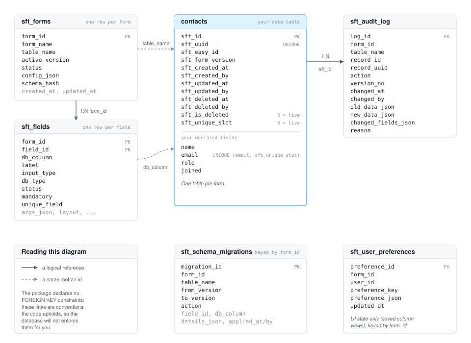

```{r setup, include = FALSE}
knitr::opts_chunk$set(collapse = TRUE, comment = "#>")
```

shinyformtools builds database-backed Shiny forms from a single declarative
description. You write down what the form *is*; the package derives the database
schema, the create/read/update/delete operations, the rendering and the Shiny
module from that one description.

This vignette follows a small application end to end and then opens the database
it produced:

1. describing a form and turning it into an app,
2. what exactly the package creates in the database,
3. how to read that data again *without* the app.

The 17 runnable examples shipped with the package cover the individual features;
`list_examples()` names them and `run_example()` starts one. This vignette is the
narrative that ties them together.

```{r library}
library(shinyformtools)
```

## 1. Describe the form

A form is a `form_id`, a database, and a list of fields. Each `form_field()`
carries everything the package needs to know about one value: its label, which
Shiny input collects it, whether it is mandatory or unique, and where it sits in
the layout.

```{r define-form}
db <- db_sqlite(tempfile(fileext = ".sqlite"))

contacts <- form(
  form_id = "contacts",
  form_name = "Contacts",
  db = db,
  fields = list(
    form_field(id = "name", label = "Name", mandatory = TRUE),
    form_field(id = "email", label = "Email", unique = TRUE),
    form_field(
      id = "role", label = "Role", input_type = "selectInput",
      args = list(choices = c("Analyst", "Engineer"))
    ),
    form_field(id = "joined", label = "Joined on", input_type = "dateInput")
  )
)
```

Note what is *not* here: no `CREATE TABLE`, no SQL, no input rendering, no
validation wiring. `mandatory = TRUE` and `unique = TRUE` are declarations, not
instructions -- the package decides how to enforce them (and enforces uniqueness
in the database itself, not only in R).

## 2. Turn it into an app

Two module functions consume the description. `form_ui()` draws the action
buttons and the records table; `form_server()` renders the dialogs and runs every
CRUD action. They are matched by `id`, exactly like any Shiny module -- only
`form_server()` needs the form object.

```{r app, eval = FALSE}
library(shiny)

ui <- fluidPage(
  titlePanel("Contacts"),
  form_ui(id = "contacts", title = "Contacts")
)

server <- function(input, output, session) {
  form_server(id = "contacts", form = contacts, user = "demo")
}

shinyApp(ui, server)
```

That is the whole application. The add and edit dialogs, the records table,
soft-delete, restore and the audit log all come from the `form()` call above.

Only the CRUD core is displayed by default; extras are opt-in on both functions,
for example `show_audit = TRUE` for the audit table or
`show_deleted_records = TRUE` for the restore dialog. Auditing and soft-delete
always happen regardless -- these flags control what is *shown*, never what is
recorded. See `run_example("app_crud_basic")` for a fuller version of this app.

## 3. What lands in the database

The form above produces this:

```{r schema-diagram, echo = FALSE, out.width = "100%", fig.alt = "Entity diagram of the six tables shinyformtools creates."}

```

Your data table sits in the middle. `sft_forms` and `sft_fields` are the form
description itself, persisted -- the package writes down what it built so it can
recognise the table later. `sft_audit_log` holds one row per mutation, which is
what makes soft-delete and restore possible. The last two are bookkeeping.

One thing the diagram is explicit about: **there are no foreign keys**. The
package declares none, on any backend. `sft_audit_log.record_id` points at
`contacts.sft_id` by convention, upheld by the code -- not by a constraint the
database enforces. If you write to these tables yourself, nothing will stop you
from breaking the link.

The rest of this section walks through the diagram. The schema is derived from
the form, and you can inspect it before anything is created: `inspect_schema()`
compares what the database currently has against what the form expects.

```{r inspect-before}
conn <- db_connect(db)

inspection <- inspect_schema(conn, contacts)
inspection$table_exists
inspection$missing_columns
```

`plan_migration()` turns that comparison into a plan. On an empty database the
plan is a single, safe action:

```{r plan}
plan <- plan_migration(conn, contacts)
plan$actions[, c("action", "db_column", "safe")]
```

`init_db()` applies it. You rarely call this yourself -- every CRUD call checks a
cheap probe first and reconciles the schema on first contact or on genuine drift
-- but calling it explicitly makes the setup step visible:

```{r init}
init_db(contacts, conn = conn, apply = TRUE, user = "setup")

DBI::dbListTables(conn)
```

A form that declared four fields produced six tables. `contacts` is the form's
own data table; the five `sft_`-prefixed ones are the package's bookkeeping,
shared by every form in the same database. (`sqlite_sequence` is SQLite's own
counter for autoincrement keys, not something shinyformtools creates.)

### The data table

```{r columns}
DBI::dbGetQuery(conn, "PRAGMA table_info(contacts)")[, c("name", "type", "pk")]
```

The last four columns are the fields you declared. Everything before them is
added by the package:

| Column | Meaning |
|---|---|
| `sft_id` | Integer primary key; the record id used by the CRUD functions. |
| `sft_uuid` | A UUID for the record; stable if rows move between databases. |
| `sft_easy_id` | Human-quotable id, `<sft_id>-<two random letters>` (e.g. `1-QZ`). |
| `sft_form_id` | The form that owns the row; several forms may share a table. |
| `sft_form_version` | The form's `version` when the record was created. |
| `sft_schema_hash` | The schema signature the row conforms to; drives drift detection. |
| `sft_created_at`, `sft_created_by` | When the record was inserted, and by which user. |
| `sft_updated_at`, `sft_updated_by` | Same for the most recent edit. |
| `sft_deleted_at`, `sft_deleted_by` | Same for the soft delete, `NULL` while live. |
| `sft_is_deleted` | `0` for live rows, `1` for soft-deleted ones. |
| `sft_unique_slot` | `0` for live rows, `sft_id` once soft-deleted (see below). |

Timestamps are ISO 8601 text, and `user` is whatever you passed to the CRUD call
or to `form_server(user = ...)` -- the package does not invent an identity.

### Uniqueness is a real index

`unique = TRUE` on the email field created a composite index, not just an R-side
check:

```{r indexes}
DBI::dbGetQuery(
  conn,
  "SELECT sql FROM sqlite_master
   WHERE type = 'index' AND tbl_name = 'contacts' AND sql IS NOT NULL"
)$sql
```

The index covers `(email, sft_unique_slot)`. Because live rows all share slot `0`,
two live records cannot hold the same email -- the database rejects it, whatever
writes the row. A soft-deleted row gets its own `sft_id` as its slot, which frees
the value for reuse while keeping the old row intact. Empty values are stored as
`NULL`, which is distinct in an index, so blank optional fields never collide.

### The system tables

`sft_forms` holds one row per form, and `sft_fields` one row per field -- the
form description itself, persisted:

```{r system-tables}
DBI::dbGetQuery(
  conn,
  "SELECT form_id, form_name, table_name, active_version, status FROM sft_forms"
)

DBI::dbGetQuery(
  conn,
  "SELECT field_id, db_column, label, input_type, db_type, mandatory, unique_field
   FROM sft_fields"
)
```

The remaining three:

- **`sft_audit_log`** -- one row per mutation, with the full before/after
  snapshots (`old_data_json`, `new_data_json`), the changed field names, the
  user, a reason, and a per-record `version_no`. Restore reads from here.
- **`sft_schema_migrations`** -- every schema action the package applied, with
  its `from_version`/`to_version` and a timestamp.
- **`sft_user_preferences`** -- per-user UI state, such as saved column views.
  Nothing about your data.

## 4. Read the database without the app

Add a couple of records, then edit one and delete another, so there is something
to look at:

```{r crud}
invisible(insert_record(
  contacts,
  list(name = "Ada Lovelace", email = "ada@example.org",
       role = "Engineer", joined = "2024-03-01"),
  conn = conn, user = "setup"
))
invisible(insert_record(
  contacts,
  list(name = "Alan Turing", email = "alan@example.org",
       role = "Analyst", joined = "2024-05-14"),
  conn = conn, user = "setup"
))

update_record(
  contacts, values = list(role = "Analyst"), record_id = 1,
  conn = conn, user = "editor", reason = "role change"
)
soft_delete_record(
  contacts, record_id = 2,
  conn = conn, user = "editor", reason = "left the company"
)
```

### With the package

`fetch_records()` is the normal way in. It hides soft-deleted rows unless you ask
for them:

```{r fetch}
live <- fetch_records(contacts, conn = conn)
live[, c("sft_easy_id", "name", "email", "role", "sft_updated_by")]

nrow(fetch_records(contacts, conn = conn))
nrow(fetch_records(contacts, conn = conn, include_deleted = TRUE))
```

### With plain SQL

Nothing above is required. The data table is an ordinary table with ordinary
columns -- any DBI connection, any SQL client, any BI tool can read it, and
shinyformtools does not need to be installed to do so:

```{r raw-sql}
DBI::dbGetQuery(
  conn,
  "SELECT sft_easy_id, name, role, joined
   FROM contacts
   WHERE sft_is_deleted = 0
   ORDER BY name"
)
```

Two things to remember when you go around the package:

- **Filter `sft_is_deleted = 0`.** There are no hard deletes, so a query without
  that predicate returns records your users believe they removed. This is the one
  mistake worth guarding against in a downstream report.
- **Multi-value fields are JSON arrays.** A single-valued input stores its value
  verbatim (`role` above is just `'Analyst'`), but an input that can hold several
  values -- a multi-select, a checkbox group -- stores a JSON array in its text
  column. Dates are ISO 8601 text.

### The audit trail

`fetch_audit_log()` returns the mutation history; `list_versions()` narrows it to
one record. Both check the schema through the same cheap probe as the CRUD
functions, so reading the history of an up-to-date database does not write to it:

```{r audit}
fetch_audit_log(contacts, conn = conn)[
  , c("record_id", "action", "version_no", "changed_by", "reason")
]
```

Every mutation is here, including the ones that are invisible in the data table:
row 2 is the edit, row 4 the delete. `list_versions()` walks a single record's
history, and `restore_record()` puts an earlier version back -- which is how the
"Deleted records" dialog and the versions accordion in the app work.

```{r versions}
list_versions(contacts, conn = conn, record_id = 1)[
  , c("version_no", "action", "changed_by", "changed_at")
]
```

```{r cleanup, include = FALSE}
db_disconnect(conn)
```

## Where to go next

The database side stays the same across backends: SQLite, DuckDB and MariaDB sit
behind the same interface, so swapping `db_sqlite()` for `db_duckdb()` or
`db_mariadb()` changes the connection and nothing else --
`run_example("app_backends")` shows this.

From here, the examples pick up individual threads:

```{r examples, eval = FALSE}
list_examples()
run_example("app_crud_basic")
```

Each example presents a step-by-step walkthrough beside the running app, plus a
"Complete code" tab you can copy out as a working application.
